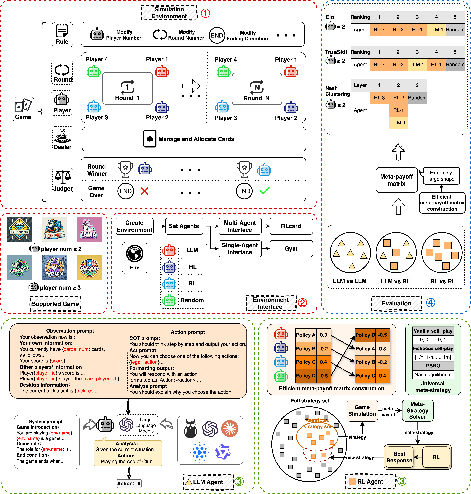

<div align= "center">
    <h1> RainbowArena</h1>
</div>


**RainbowArena: A Multi-Agent Toolkit for Reinforcement Learning and Large Language Models in Competitive Tabletop Games**


Tabletop games have gained little to no attention, despite offering a range of unique challenges compared to card or board games. We introduce RainbowArena, an open-source toolkit for reinforcement learning and large language models in competitive tabletop games. The goal of RainbowArena is to provide a unified, scalable platform that supports both reinforcement learning (self-play) and large language models, and push forward the research in tabletop games. RainbowArena consists of three core modules: game, agent and evaluation. We design unified components and interfaces for various tabletop games. To better integrate with game environments, we devise an efficient and unified self-play framework for reinforcement learning agents, and a standardized prompt structure for LLM agents. Additionally, agents of all types can be evaluated within the evaluation framework. Finally, we evaluate various types of agents across different games and analyze the runtime efficiency for each game.

<div style="display: flex; justify-content: center;">
  <div style="width: 100; transform: scale(1.0);">
    
  </div>
</div>


---
## Table of Contents

Comming Soon


[//]: # (- [Features]&#40;#features&#41;)

[//]: # (- [Architecture]&#40;#architecture&#41;)

[//]: # (  - [Folder Structure]&#40;#folder-structure&#41;)

[//]: # (  - [Key Components]&#40;#key-components&#41;)

[//]: # (- [Installation]&#40;#installation&#41;)

[//]: # (  - [Prerequisites]&#40;#prerequisites&#41;)

[//]: # (  - [Setup Steps]&#40;#setup-steps&#41;)

[//]: # (- [Usage]&#40;#usage&#41;)

[//]: # (  - [Running the Simulation]&#40;#running-the-simulation&#41;)

[//]: # (  - [Configuration]&#40;#configuration&#41;)

[//]: # (- [Contributing]&#40;#contributing&#41;)

[//]: # (- [License]&#40;#license&#41;)

[//]: # (- [Contact]&#40;#contact&#41;)

[//]: # ()
[//]: # (---)

[//]: # ()
[//]: # (## Features)

[//]: # ()
[//]: # (- **Modular Design**: Easily extend or replace components like agents, environments, and LLM integrations.)

[//]: # (- **Multi-Agent Support**: Model complex interactions between multiple agents with hierarchical or cooperative execution modes.)

[//]: # (- **LLM Integration**: Interface with various LLM providers &#40;OpenAI, etc.&#41; through a unified API.)

[//]: # (- **Shared Memory**: Implement shared memory mechanisms for agent communication and collaboration.)

[//]: # (- **Flexible Environments**: Support for different simulated environments like web-based tasks.)

[//]: # (- **Metrics and Evaluation**: Built-in evaluation metrics to assess agent performance on tasks.)

[//]: # (- **Industrial Coding Standards**: High-quality, well-documented code adhering to industry best practices.)

[//]: # (- **Docker Support**: Containerized setup for consistent deployment and easy experimentation.)

[//]: # ()
[//]: # (<div style="display: flex; justify-content: center;">)

[//]: # (  <div style="width: 100; transform: scale&#40;1.0&#41;;">)

[//]: # (    )

[//]: # (  </div>)

[//]: # (</div>)

[//]: # ()
[//]: # ()
[//]: # (---)

[//]: # ()
[//]: # ()
[//]: # (### Install from scratch)

[//]: # ()
[//]: # (Use a virtual environment, e.g. with anaconda3:)

[//]: # ()
[//]: # (```bash)

[//]: # (conda create -n marble python=3.10)

[//]: # (conda activate marble)

[//]: # (curl -sSL https://install.python-poetry.org | python3)

[//]: # (export PATH="$HOME/.local/bin:$PATH")

[//]: # (```)

[//]: # ()
[//]: # (### Configure environment variables)

[//]: # (Environment variables such as `OPENAI_API_KEY` and `Together_API_KEY` related configs are required to run the code. The recommended way to set all the required variable is)

[//]: # (1. Copy the `.env.template` file into the project root with the name `.env`.)

[//]: # (```bash)

[//]: # (cp .env.template .env)

[//]: # (```)

[//]: # (2. Fill the required environment variables in the `.env` file.)

[//]: # ()
[//]: # (### Running the examples)

[//]: # (To run examples provided in the `examples`:)

[//]: # ()
[//]: # (```bash)

[//]: # (poetry install)

[//]: # (cd scripts)

[//]: # (cd werewolf)

[//]: # (bash run_simulation.sh)

[//]: # (```)

[//]: # ()
[//]: # (#### New branch for each feature)

[//]: # ()
[//]: # (`git checkout -b feature/feature-name` and PR to `main` branch.)

[//]: # ()
[//]: # (#### Before committing)

[//]: # ()
[//]: # (Run `poetry run pytest` to make sure all tests pass &#40;this will ensure dynamic typing passed with beartype&#41; and `poetry run mypy --config-file pyproject.toml .` to check static typing. &#40;You can also run `pre-commit run --all-files` to run all checks&#41;)

[//]: # ()
[//]: # (#### Check github action result)

[//]: # ()
[//]: # (Check the github action result to make sure all tests pass. If not, fix the errors and push again.)

[//]: # ()
[//]: # (## Citation)

[//]: # (Please cite the following paper if you find Marble helpful!)

[//]: # (```bibtex)

[//]: # (@misc{zhu2025multiagentbenchevaluatingcollaborationcompetition,)

[//]: # (      title={MultiAgentBench: Evaluating the Collaboration and Competition of LLM agents},)

[//]: # (      author={Kunlun Zhu and Hongyi Du and Zhaochen Hong and Xiaocheng Yang and Shuyi Guo and Zhe Wang and Zhenhailong Wang and Cheng Qian and Xiangru Tang and Heng Ji and Jiaxuan You},)

[//]: # (      year={2025},)

[//]: # (      eprint={2503.01935},)

[//]: # (      archivePrefix={arXiv},)

[//]: # (      primaryClass={cs.MA},)

[//]: # (      url={https://arxiv.org/abs/2503.01935},)

[//]: # (})

[//]: # (```)

[//]: # ()
[//]: # (<p align="center">)

[//]: # (<a href="https://star-history.com/#Significant-Gravitas/AutoGPT">)

[//]: # (  <picture>)

[//]: # (    <source media="&#40;prefers-color-scheme: dark&#41;" srcset="https://api.star-history.com/svg?repos=MultiagentBench/MARBLE&type=Date&theme=dark" />)

[//]: # (    <source media="&#40;prefers-color-scheme: light&#41;" srcset="https://api.star-history.com/svg?repos=MultiagentBench/MARBLE&type=Date" />)

[//]: # (    )

[//]: # (  </picture>)

[//]: # (</a>)

[//]: # (</p>)
